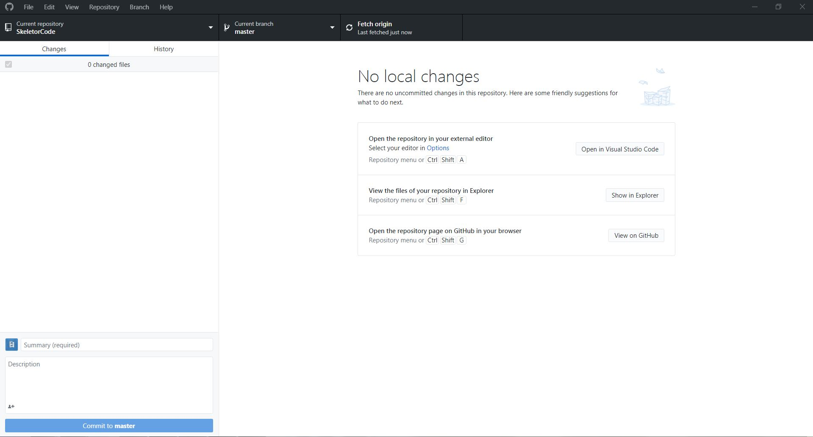

## GitHub Enviroment Setup
This tutorial will walk you through the installation of GitHub Desktop on your machine.

## Steps
1. Create an account at [GitHub](github.com/join) (and post the user name here)
2. (recommended) Go to [GitHub education](education.github.com/) to receive student benefits
3. Download [GitHub Desktop](desktop.github.com)
4. Login with your GitHub creditinals

## Presentaion wiht pciture and more infomration
Note: This presentaion contains quite a bit of information that has been spread out throughout various tutorials on this site.
[Current link](https://docs.google.com/presentation/d/e/2PACX-1vRZlrW9X5Tn2a9EdpZ2iVTtD4TPZJUqQlTI4D0ThXZwhgwMI8DkeJMmreyRZ4Eh2ZlNa5eA1I8kLV7d/pub?start=false&loop=false&delayms=3000)

## Next:
[Navigateing the GitHub Desktop Interface]()
[Index](index)
