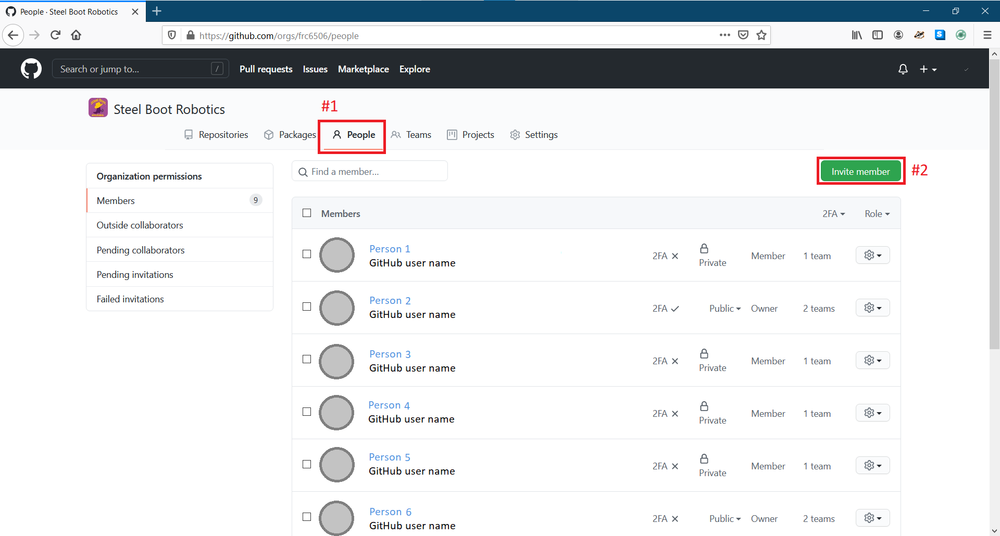
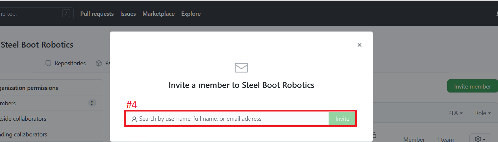
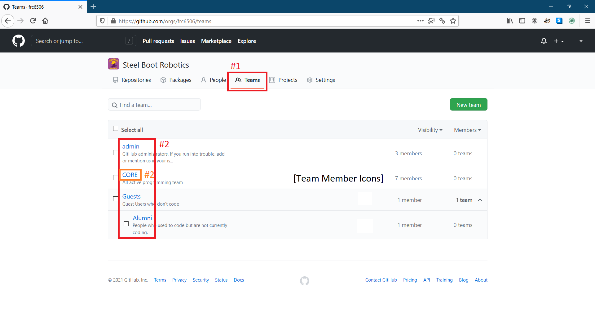
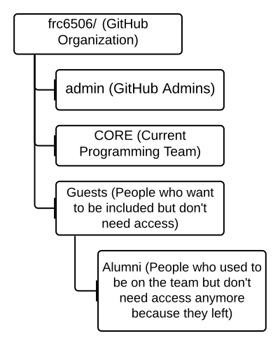
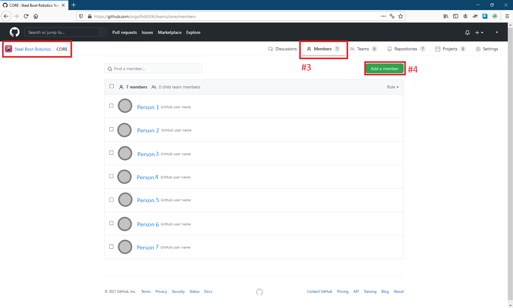
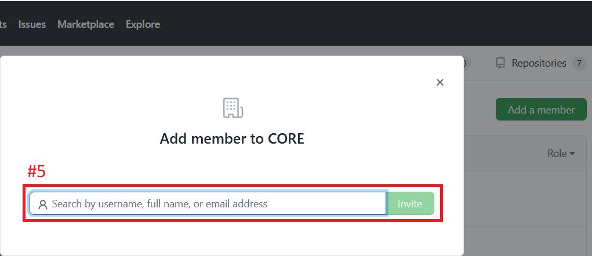

# How to Add New Members

This guide will explain how to add new members to the GitHub organization and then add them to the appropriate team.

## Adding people to the GitHub organization

> This section is for adding a team member.  If you want to add an `outside collaborator` to keep things neat, such as for a mentor, the process is slightly different.

> You will need to know everyone's GitHub username to complete this guide, or at least the email that they signed up for GitHub with.

1. Navigate to [github.com/orgs/frc6506/people](https://github.com/orgs/frc6506/peoples) in a browser, either directly or by going to the organization [home page](https://github.com/orgs/frc6506) and clicking on `People`
2. Click on `Invite member`
3. Type the GitHub user name or the email address the person used to sign up for GitHub into the search box.  Then select them when the show up.  Then click `Invite`.!

4. The person invited should get an email notification.  It should also show up on [github.com](https://github.com) when they log in
5. Repeat steps 2 through 4 as necessary to add everyone.

## Adding people to a team

Now that people are part of the GitHub organization, they still needed to be added to a team in order to simply access control.

> This section mostly assumes that one is adding regular members to the `CORE` team for example purposes, however it is not hard to select a different team instead.

1. Navigate to [github.com/orgs/frc6506/teams](https://github.com/orgs/frc6506/teams) in a browser, either directly or by clicking on `Teams` tab.
2. Click on the team you want to edit to go to that team's home/profile page.  For example, the `CORE` team should contain all of the current programmers.  Here is a diagram of the available teams:

3. Once your on the teams home/profile page, click on the `Members` tab.
4. Click on `Add a member`

5. Type the GitHub user name or the email address the person used to sign up for GitHub into the search box.  Then select them when the show up.  Then click `Invite`.!
6. Repeat steps 4 through 5 as necessary to add everyone to the team.

 
[Admin Overview](https://frc6506.github.io/docs/gitHubAdmin/overview)
[Site Index](https://frc6506.github.io/docs/index)
 
_Updated 20210427_
