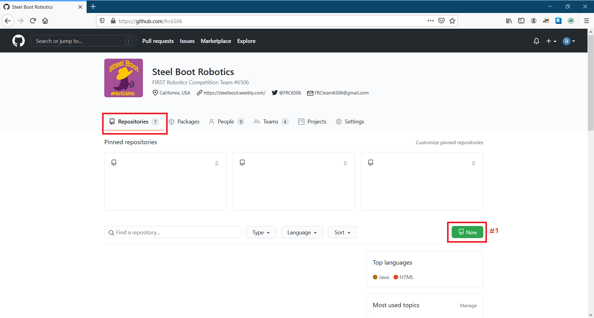
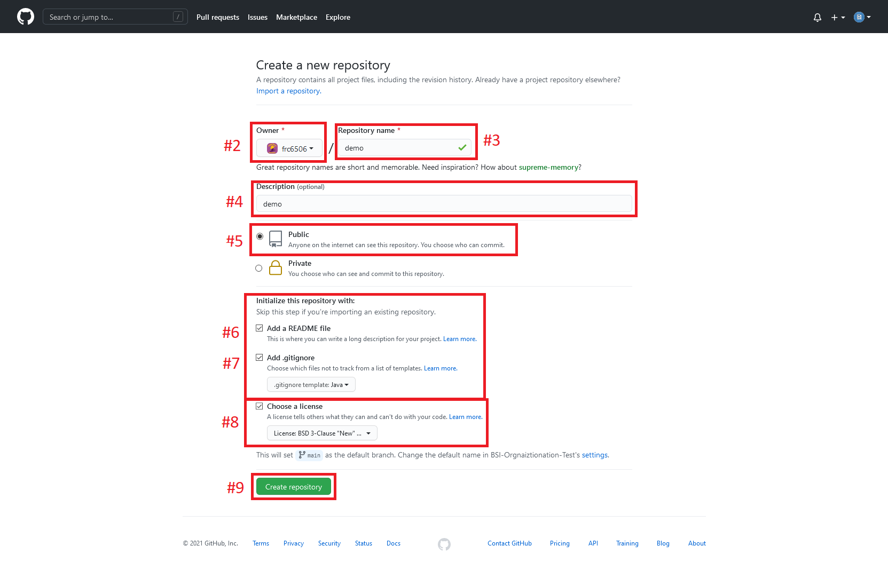
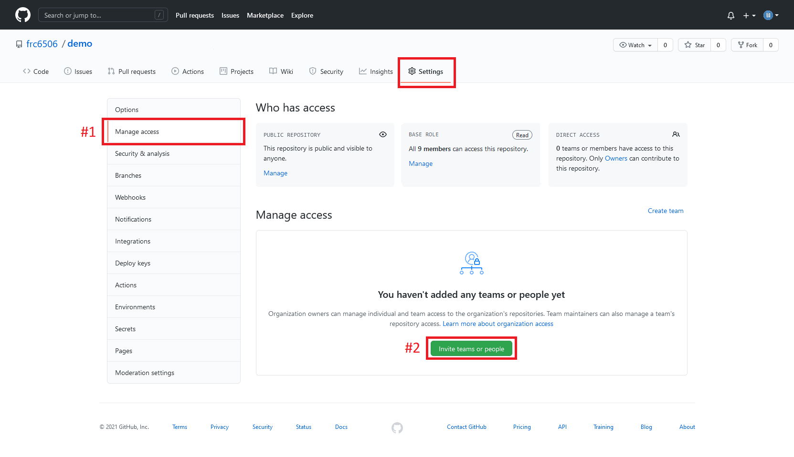
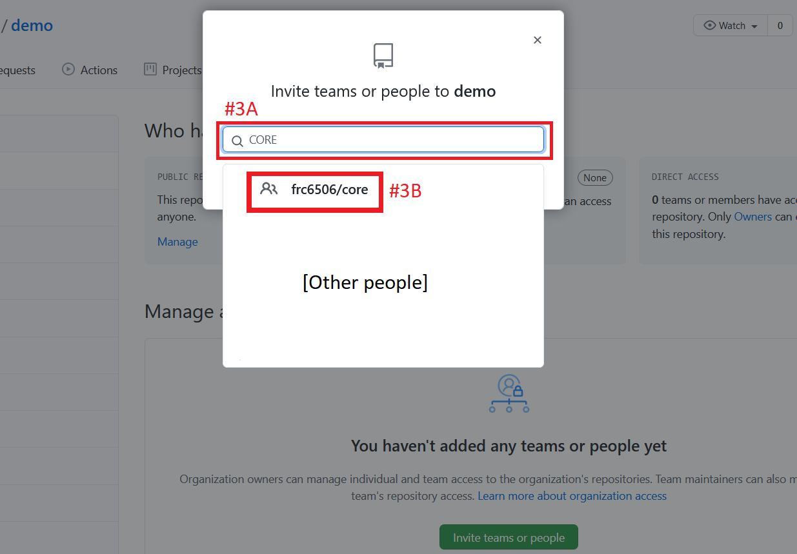
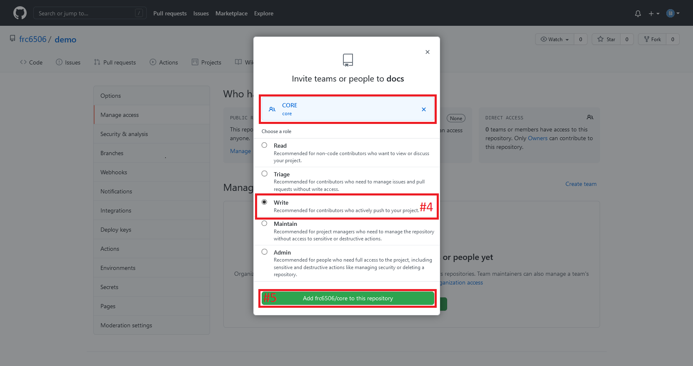

# Repositories Quick Setup Guide

This guide will explain how to create an official team repository and share it with the programming team.

## Initial Creation

1. Click New
 

1. Ensure that the owner is listed as `frc6506`.
   > This ensures that the team can track, look back on, and archive old work.
1. Give it name- include the project and year.  We don't currently have a set pattern yet.
1. Give it a description
1. Set the repository to `Public`.
   > Most FRC doing is not too complex or special, so theres not reason not try to be friendly with others.  It also makes it easier to work with others.
1. Make sure `Add a README file` is checked.  This will present a nice space to make notes on the project.
1. For WPILib-j projects: Check `Add .gitignore` and select `Java` for the `.gitignore template`.
   > This saves bandwidth by ignore build optimization files that can easily be generated locally.
1. Feel free to ignore the `Choose a license` button, however if you do selected it, FIRST prefers the BSD-3-clause license.
1. Click `Create repository`

## Initial Setup (Optional Part)

Turn off things you don't need/won't use in `Settings` > `Options`.  These are designed for if you plan on allot of outside people using and working on your project:

- `Wikis`
- `Sponsorships` (off by default)
- `Discussions`  (off by default)

## Initial Setup (Necessary Part)

Now that you have a repository, you need to prepare it fo use by the programming team.
   > Note that this tutorial assumes one is adding an entire organizational team to the repository instead of adding everyone individually.  You can also use these instructions to add other people who are not part of a team quickly, although the `Invite teams or people` button may move around.

1. Go to `Manage access`
1. Click on `Invite teams or people`
 

1. Search for `CORE` and select `frc6506/core`

1. Select `Write` to allow all members of the `frc6506/CORE` (the main programming team) team to write.  Don't worry about admins, organization admins already have acce4ss to everything.
1. Click the green `Add frc6506/core to this repository` button.

 
You can now clone the repository to your computers and use it to manage files and versions.  See the index for help getting started with git/GitHub on your local computer and FRC coding.

 
[Admin Overview](overview)
[Site Index](https://frc6506.github.io/docs/index)
 
_Updated 20210416T1509 PDT_
