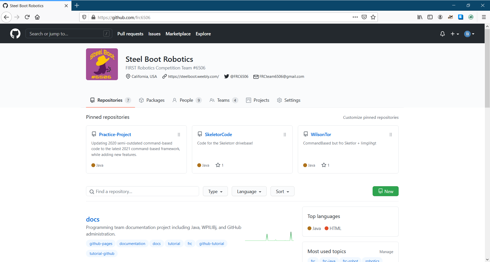

# Repositories tab

This serves as our organizations homepage and lists the different repositories owned by the team.

## Notes

- The pinned repository section can be used to show off relevant and cool projects.

## Repository Settings

## Related Guides

[Creating a Repository quick start guide](quickGuides/repositoryQuickSetup)

 
[Admin Overview](https://frc6506.github.io/docs/gitHubAdmin/overview)
[Site Index](https://frc6506.github.io/docs/index)
 
_Updated 20210515T1845 PDT_
