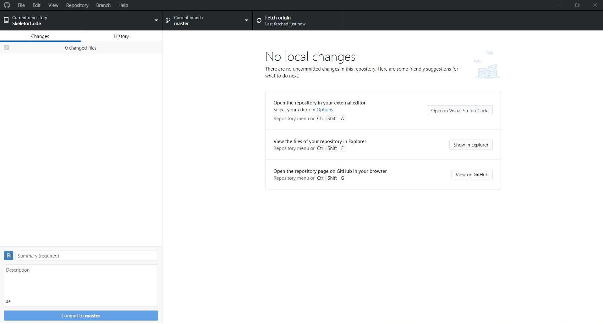

# GitHub Account Setup

This tutorial will walk you through the steps of creating a GitHub Account

## Account

1. Create an account at [GitHub (github.com/join)](https://github.com/join) (and post your user name in the [programming](https://shsrobotics6506.slack.com/archives/CCF7E9P1B) channel on Slack).
   > It is recommended that you use your school email in order to get perks.
2. You can now login with your GitHub credentials

## Optional- Get the GitHub Student Developer Pack (free)

> This requires the use of a student email account.

1. Go to [GitHub education (education.github.com)](https://education.github.com).
2. Click "Get Benefits"

## Next

In order to interface with the remote git server, you need to do one of three things:

- Install GitHub Desktop, which has lots of features while being simple.
   
   [Instructions](setupGitHubDesktop)
- Use the generic git management built into VS Code, which is simple.
- (Advanced) Use git from the command line.

 
[Index](https://frc6506.github.io/docs/index)

 
__Updated 20201201T1430 PT__
