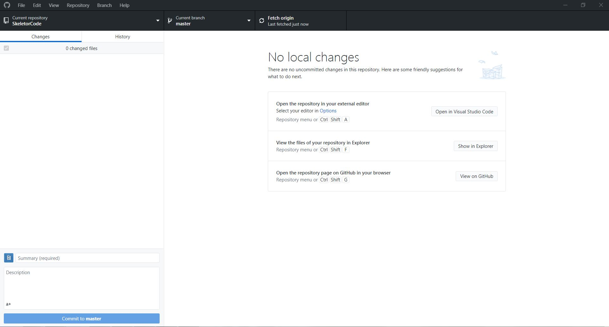

# GitHub Environment Setup

This tutorial will walk you through the installation of GitHub Desktop on your machine.

## Steps

1. Download [GitHub Desktop](https://desktop.github.com)
2. Login with your GitHub credentials

## Next

[Navigating the GitHub Desktop Interface](quickstart/gitHubDesktopTut)

[Index]((https://frc6506.github.io/docs/index))
